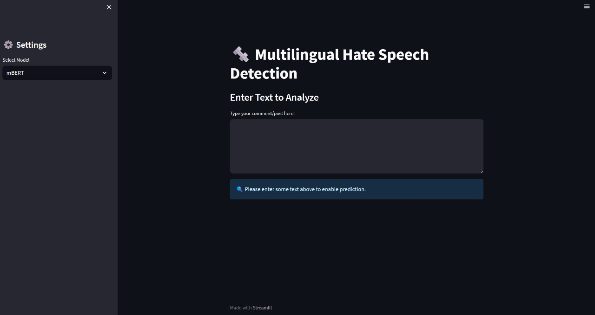
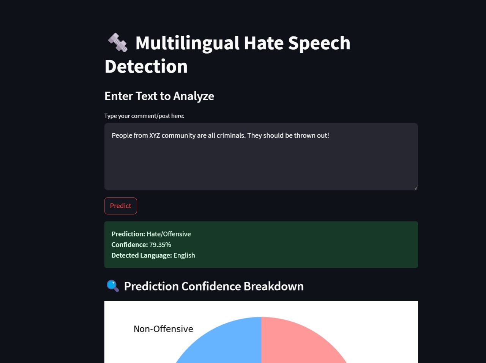
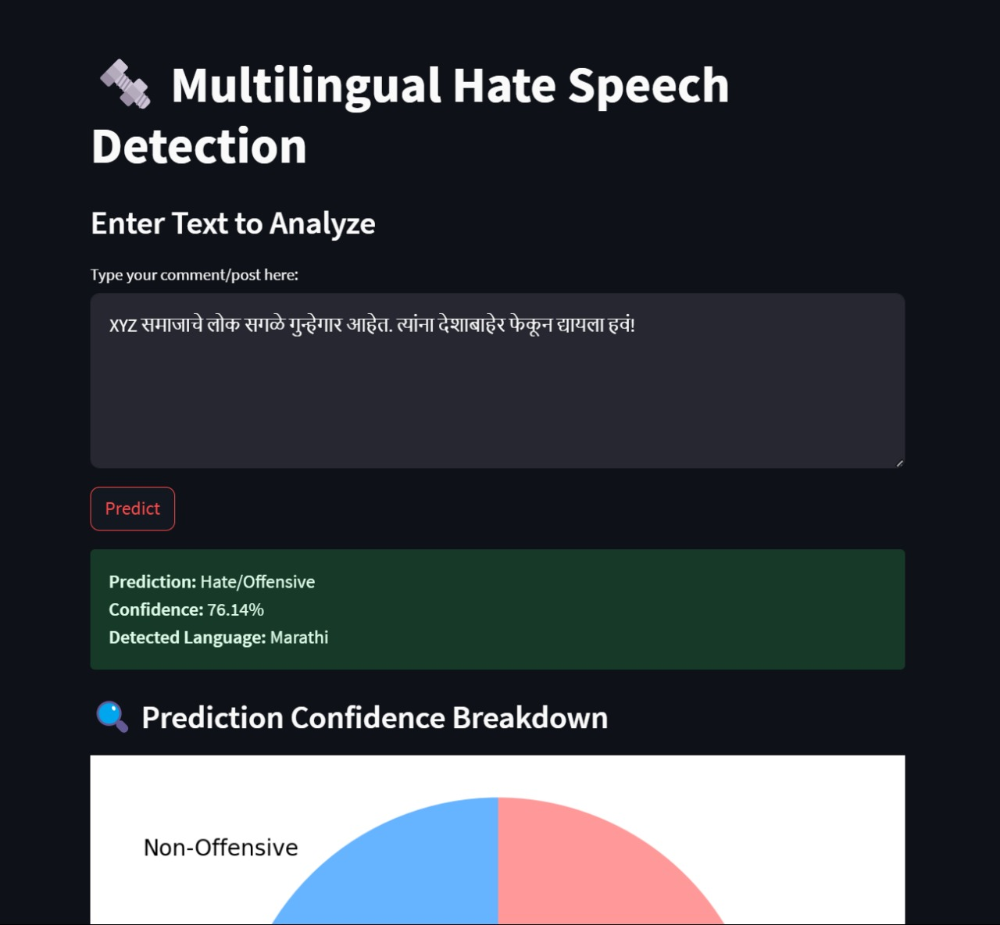
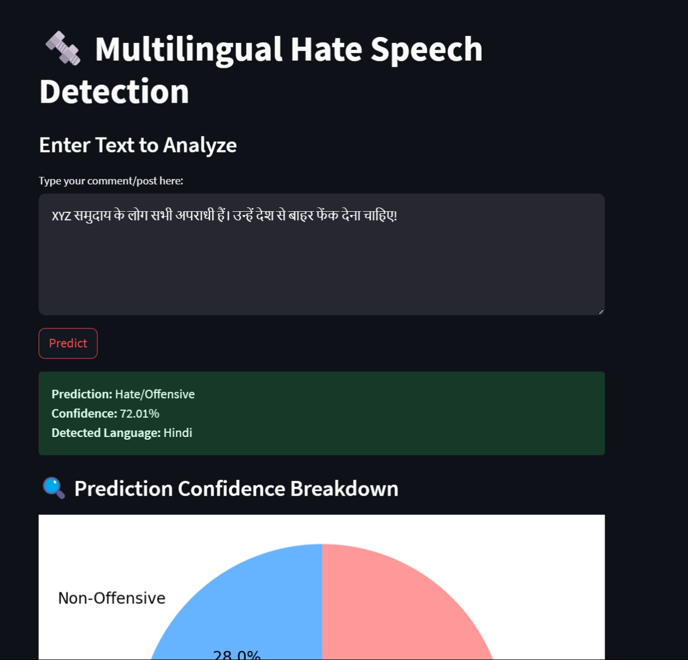
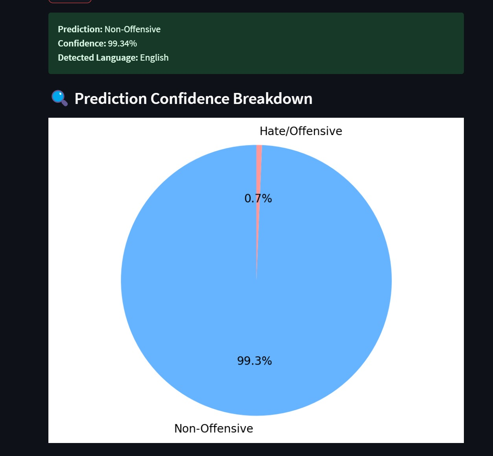

# Multilingual Hate Speech Detection using Transformer Models

## 🚀 Project Overview

With the rise of online communication, hate speech has transcended linguistic and national borders, becoming a transnational and culturally complex issue. Our project tackles this problem head-on by building a **scalable, multilingual hate speech classifier** using **Transformer-based models (mBERT and XLM-RoBERTa)**.

We trained and evaluated our models on the **HASOC 2021 multilingual dataset** (English, Hindi, Marathi) and deployed a **real-time detection web app using Streamlit**. This project aims to bridge the gap between cutting-edge research and practical deployment for content moderation, NGO monitoring, and user flagging systems.



---

## 🧠 Core Features

- 🌐 **Multilingual Classification**: Detect hate speech across English, Hindi, and Marathi.
- 🔍 **Cross-lingual Generalization**: XLM-RoBERTa outperforms mBERT, especially for low-resource languages.
- 🧪 **Real-Time Web App**: Streamlit-powered app for live text detection and demonstration.
- 📊 **Robust Evaluation**: Weighted F1, precision, recall, PR curves, and loss analysis.
- ⚡ **Scalable Pipeline**: Easily adaptable for more languages with better compute resources.
- 🧱 **Reproducibility-Oriented**: Models selected based on performance, resource efficiency, and popularity.






---

## 📦 Project Structure

```text
📦 multilingual-hate-speech
┣ 📂models
┃ ┣ 📄xlmr_model.pt
┃ ┣ 📄mbert_model.pt
┣ 📂data
┃ ┣ 📄hasoc2021_train.csv
┃ ┣ 📄hasoc2021_test.csv
┣ 📂app
┃ ┣ 📄streamlit_app.py
┣ 📂notebooks
┃ ┣ 📄training_xlmr.ipynb
┃ ┣ 📄training_mbert.ipynb
┣ 📄requirements.txt
┣ 📄README.md
 ```

---

## 🧪 Model Performance

| Model        | Weighted F1 | Precision | Recall |
|--------------|-------------|-----------|--------|
| **XLM-R**    | **0.86**    | 0.87      | 0.85   |
| mBERT        | 0.83        | 0.84      | 0.82   |

- XLM-R significantly outperformed mBERT, especially on the **Marathi subset**.
- **Multilingual models** outperformed **monolingual baselines**.
- Smooth PR curves and training/validation losses indicate **stable learning dynamics**.

---

## ⚙️ Installation & Setup

1. **Clone the repository**:
   ```bash
   git clone https://github.com/yourusername/multilingual-hate-speech.git
   cd multilingual-hate-speech

2. python -m venv venv
   source venv/bin/activate  # On Windows use `venv\Scripts\activate`

3. pip install -r requirements.txt

4. streamlit run app/streamlit_app.py

# 🌍 Multilingual Hate Speech Detection

## 🌍 Why mBERT and XLM-RoBERTa?

- 🌐 Widely used in multilingual tasks and well-supported by research.
- ⚡ Lower resource needs than newer models like mT5 or BLOOM.
- 🔁 Easy to fine-tune on small datasets (like HASOC) without overfitting.
- 🔬 Facilitates reproducibility and comparison with current benchmarks.

---

## 🚧 Limitations

- 🧠 High memory and compute usage.
- 🐌 Training time limited by hardware (no multi-GPU or TPU).
- ❗ Real-time inference costly without approximation methods.
- 🔄 Model drift (slang, new hate patterns) requires regular retraining.

---

## 🔮 Future Work

- 📈 Introduce active drift detection (e.g., embedding-based monitoring).
- ☁️ Migrate to cloud-based or multi-GPU infrastructure.
- 🌍 Expand language support (e.g., Tamil, Bengali, Urdu).
- 🧩 Integrate user context or history for better classification accuracy.

---

## 🙌 Acknowledgments

- 🔗 [Hugging Face Transformers](https://huggingface.co/transformers/)
- 🔗 [HASOC Shared Task](https://hasocfire.github.io/hasoc/)
- 🔗 [Streamlit](https://streamlit.io/)
- 📊 Research support from **CDC**, **Global Witness**, and **Human Rights Watch (HRW)**

---

## 📬 Contact

For questions, suggestions, or collaborations, please reach out at:

📧 [royaditiindia@gmail.com] [ayushmukherjee2017@gmail.com]


